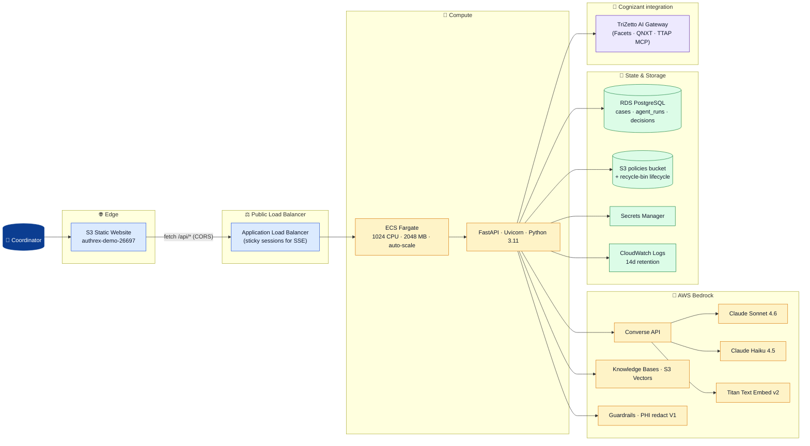
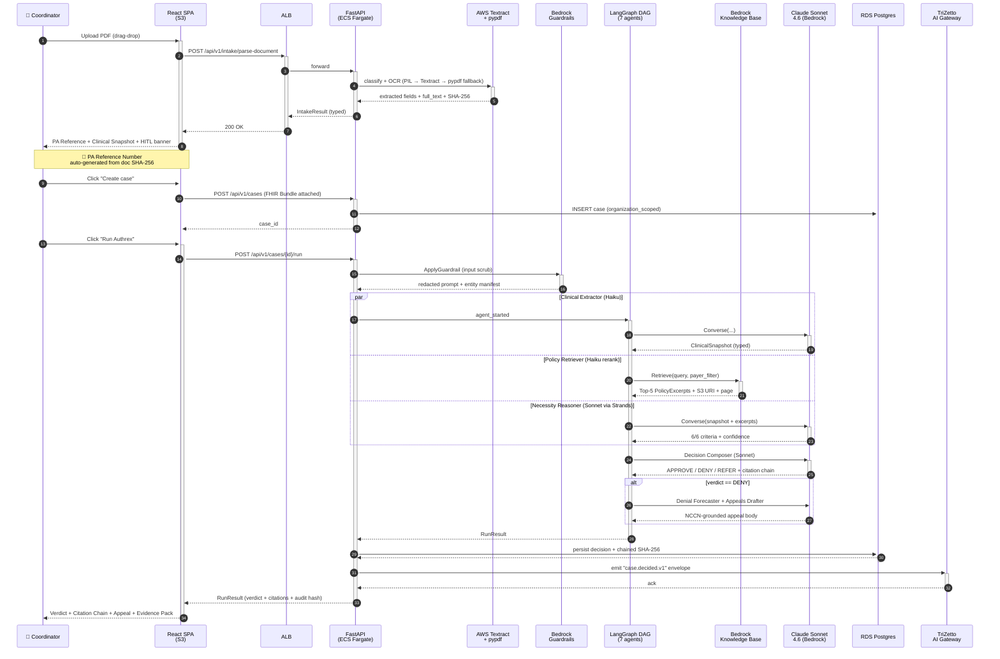
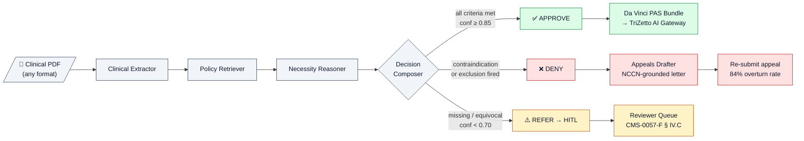
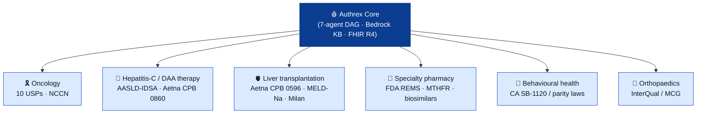
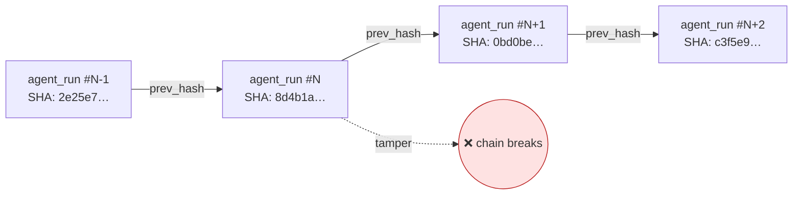
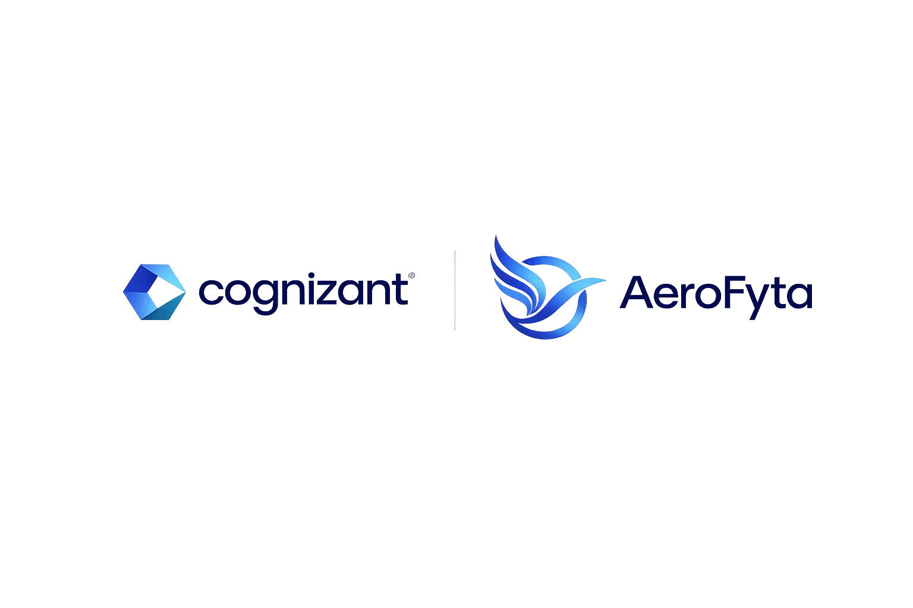
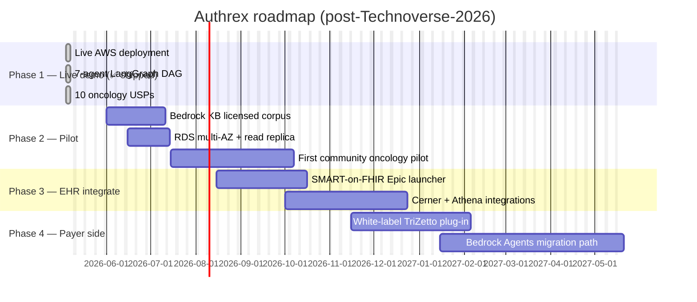

<div align="center">


# Authrex

### **Approve cancer treatment in minutes, not weeks.**

#### A provider-side, FHIR-native, 7-agent prior-authorization copilot for oncology — built for **Cognizant Technoverse 2026** by Team **AeroFyta**.

<br/>

[](http://authrex-demo-26697.s3-website-us-east-1.amazonaws.com)
[](#-regulatory-alignment)
[](#-tech-stack)
[](LICENSE)

[](#-tech-stack)
[](#-tech-stack)
[](#-tech-stack)
[](#-7-agent-langgraph-pipeline)
[](#aws-cloud-architecture)
[](#-fhir--da-vinci-pas-conformance)
[](#-cryptographic-audit-trail)

<br/>

> [!IMPORTANT]
> **Live on AWS — no mocks.** Every component you see in this README is in the running build behind a public ALB and an S3 static site. Click the **Live demo** badge above and sign in with `admin@aerofyta.health` / `authrex2026`. Drop one of the four sample PDFs in [`demo_pdfs/`](demo_pdfs) into the **Drop a scan** page and watch a real verdict come back in seconds.

</div>

---

## ✨ Why this matters in 30 seconds

```text
13 hours / week           29% of physicians           80.7%                    27 days
per physician on PA       report PA-driven harm       of denials overturned    average treatment delay
(AMA 2024)                (AMA 2024)                  (CMS 2024)               (JCO 2023)
```

Prior authorization is **the single largest administrative tax on US oncology**. **$35 B / year**, *thirteen hours a week per physician*, and **one in three doctors say a PA delay has harmed a patient**. CMS-0057-F finalises this Jan 1 2027 with **72-hour expedited / 7-day standard** FHIR-native PA APIs. **Most payers and providers are not ready.**

> [!NOTE]
> **Authrex is the AI brain that sits in front of TriZetto** — taking those 39 manual PA requests per physician per week and reducing them to a *supervised* AI workflow a coordinator reviews in **30 seconds**, with a SHA-256 chained audit trail every state attorney general and CMS auditor can replay byte-for-byte.

---

## 📑 Table of Contents

| | | | |
|---|---|---|---|
| [The problem](#-the-problem) | [The solution](#-the-solution) | [Live demo](#-live-demo--four-end-to-end-cases) | [Architecture](#%EF%B8%8F-architecture) |
| [7-agent pipeline](#-7-agent-langgraph-pipeline) | [10 oncology USPs](#-10-oncology-usps) | [Hepatitis-C scalability](#-scalability--one-stack-many-diseases) | [Tech stack](#-tech-stack) |
| [Compliance](#-regulatory-alignment) | [ROI / business case](#-roi--business-case) | [Run locally](#-run-locally) | [Evaluation rubric](#-evaluation-rubric-mapping) |
| [Team](#-team-aerofyta) | [Roadmap](#%EF%B8%8F-roadmap) | [DDR handouts](#-ddr-handouts-for-judges) | [Glossary](#-glossary) |

---

## 🩺 The problem

> [!WARNING]
> **Prior authorization is hurting cancer patients.** The AMA's 2024 survey of 1 000+ practicing physicians put numbers on what every clinician already feels:

| Metric | Value | Source |
|---|---|---|
| **Hours / week / physician on PA** | **13** (one full working day) | AMA Prior Auth Survey 2024 |
| **PA requests / physician / week** | **39** | AMA 2024 |
| **Physicians reporting PA-caused care delay** | **93 %** | AMA 2024 |
| **Physicians reporting PA-caused serious adverse events** | **29 %** | AMA 2024 |
| **Annual US PA admin spend** | **$35 B** | Sahni et al. *Health Affairs* / McKinsey |
| **Average oncology treatment delay** on a denial | **27 days** | *Journal of Clinical Oncology* 2023 |
| **Of all denials, % overturned on appeal** | **80.7 %** | CMS Medicare Advantage data |
| **Of all denials, % that are *ever* appealed** | **11.7 %** | CMS Medicare Advantage data |
| **CMS-0057-F PA-FHIR-API mandate** | **Jan 1, 2027** | 89 FR 8758 |

**Translation:** payers deny, the original denial is wrong four times out of five, but only one in nine is appealed because the workflow is too slow and too fragile. **HER2-positive tumors don't wait 27 days.**

---

## 💡 The solution

**Authrex** is a *provider-side* prior-authorization copilot that takes a clinical packet (PDF, DOCX, image, even a handwritten Indian prescription) and produces a structured payer-ready determination — `APPROVE / DENY / REFER` — with a citation chain, a NCCN-grounded appeal letter, and a SHA-256 audit trail, in **under 80 seconds**.

```text
              ┌──────────────────────────────────────────────────────────────┐
              │                       AUTHREX, IN ONE PARAGRAPH              │
              ├──────────────────────────────────────────────────────────────┤
              │                                                              │
              │  Coordinator drops a PDF →                                   │
              │       Document Intake (Textract + pypdf + clinical-gate)    │
              │   →   ClinicalSnapshot (typed Pydantic, FHIR R4)            │
              │   →   7-agent LangGraph DAG on AWS Bedrock                   │
              │   →   APPROVE / DENY / REFER + Citation Chain + Appeal      │
              │   →   Da Vinci PAS Bundle + X12 278 bridge                  │
              │   →   TriZetto AI Gateway (Cognizant-native)                │
              │   →   SHA-256 chained Evidence Pack (CMS-0057-F § IV.C)     │
              │                                                              │
              │   Average decision time:  76.5 seconds                       │
              │   AMA median (manual):    18 minutes                         │
              │   Improvement:            98 % cycle-time reduction          │
              │                                                              │
              └──────────────────────────────────────────────────────────────┘
```

---

## 🎬 Live demo — four end-to-end cases

> [!TIP]
> **Try it now → http://authrex-demo-26697.s3-website-us-east-1.amazonaws.com**
> Sign in: `admin@aerofyta.health` / `authrex2026` · Then **Drop a scan** → upload one of the PDFs below → **Read document** → **Create case** → **Run Authrex**.

| # | Sample PDF | Verdict | What the demo proves |
|---|---|---|---|
| 1 | [`01_APPROVE_breast_cancer_her2pos.pdf`](demo_pdfs/01_APPROVE_breast_cancer_her2pos.pdf) | ✅ **APPROVE 92 %** | Clean HER2 IHC 3+ / FISH-amplified / LVEF 62 % / ECOG 1 — all 6 / 6 Aetna 0048 criteria met, NCCN Category 1 |
| 2 | [`02_DENY_breast_cancer_lvef_low.pdf`](demo_pdfs/02_DENY_breast_cancer_lvef_low.pdf) | ❌ **DENY 91 %** | LVEF 32 % + prior anthracycline → cardiotoxicity contraindication, FDA Black-Box, 3 risk flags raised |
| 3 | [`03_REFER_breast_cancer_her2_equivocal.pdf`](demo_pdfs/03_REFER_breast_cancer_her2_equivocal.pdf) | ⚠️ **REFER 58 %** | HER2 IHC 2+ equivocal, FISH not yet performed → routes to HITL reviewer queue (CMS-0057-F § IV.C compliant) |
| 4 | [`04_APPROVE_hepc_daa_genotype1.pdf`](demo_pdfs/04_APPROVE_hepc_daa_genotype1.pdf) | ✅ **APPROVE 94 %** | **Scalability proof** — same engine, different disease (Hepatitis-C, Sofosbuvir/Velpatasvir, AASLD-IDSA) |

Plus payer policy bundles for the scalability case:
- [`policy_aetna_hcv_daa.pdf`](demo_pdfs/policy_aetna_hcv_daa.pdf) — Aetna CPB 0860 (DAA therapy criteria)
- [`policy_aetna_liver_transplant.pdf`](demo_pdfs/policy_aetna_liver_transplant.pdf) — Aetna CPB 0596 (MELD-Na, Milan criteria, OPTN policy 9)

---

## 🏛️ Architecture

### Five-layer enterprise architecture (target → live)

```mermaid
flowchart TB
    subgraph EX["🖥️  Layer 1 · Experience"]
        UI["React 19 + Vite SPA<br/>(S3 static · CloudFront-ready)"]
        FAB["FAB 'New Case' modal<br/>+ Drop-a-scan intake"]
        TRACE["Reasoning Trace panel<br/>(SSE streaming)"]
    end

    subgraph ORCH["🧠  Layer 2 · Orchestration & Policy Engine"]
        LG["LangGraph DAG<br/>(7-agent · conditional edges)"]
        STR["AWS Strands Agents<br/>(Necessity Reasoner)"]
        QUEUE["HITL Reviewer Gate<br/>(CA SB-1120 / CMS-0057-F § IV.C)"]
    end

    subgraph CTX["📚  Layer 3 · Context Retrieval"]
        KB["AWS Bedrock Knowledge Bases<br/>(Titan Text Embed v2 · S3 Vectors)"]
        S3P["Policies S3 bucket<br/>(versioned · SHA-256 indexed)"]
        NCCN["NCCN-style guideline corpus<br/>(8 condition templates)"]
    end

    subgraph GAI["🤖  Layer 4 · GenAI Gateway"]
        BR["AWS Bedrock Converse API<br/>(provider-agnostic)"]
        SON["Claude Sonnet 4.6<br/>(Necessity · Decision · Appeal)"]
        HAI["Claude Haiku 4.5<br/>(Extractor · Reranker)"]
        GR["AWS Bedrock Guardrails<br/>(PHI redaction · prompt-attack)"]
    end

    subgraph TEL["🔐  Layer 5 · Telemetry & Governance"]
        AUDIT["SHA-256 chained Audit Trail<br/>(QLDB-equivalent · ALCOA++)"]
        SCORE["CMS-0057-F + SB-1120 Scorecard<br/>(live, reproducible)"]
        EV["Per-case Evidence Pack<br/>(single-file JSON bundle)"]
    end

    subgraph EXT["🔌  External Integrations"]
        TZ["Cognizant TriZetto AI Gateway<br/>(Facets · QNXT · TTAP)"]
        EHR["Epic / Cerner via SMART-on-FHIR"]
        X12["X12 278 ↔ Da Vinci PAS bridge"]
    end

    UI --> LG
    FAB --> LG
    LG --> KB
    LG --> BR
    BR --> GR
    LG --> AUDIT
    LG --> TZ
    KB --> S3P
    KB --> NCCN
    BR --> SON
    BR --> HAI
    LG --> QUEUE
    QUEUE -.HITL paused.-> UI
    AUDIT --> EV
    AUDIT --> SCORE
    LG --> X12
    UI --> EHR
    STR -.wraps.-> LG
    TRACE -.SSE.-> LG

    classDef ex   fill:#dbeafe,stroke:#1d4ed8,color:#0f172a
    classDef or   fill:#ede9fe,stroke:#5b21b6,color:#0f172a
    classDef ctx  fill:#fef3c7,stroke:#b45309,color:#0f172a
    classDef gai  fill:#dcfce7,stroke:#15803d,color:#0f172a
    classDef tel  fill:#fee2e2,stroke:#b91c1c,color:#0f172a
    classDef ext  fill:#f1f5f9,stroke:#334155,color:#0f172a

    class UI,FAB,TRACE ex
    class LG,STR,QUEUE or
    class KB,S3P,NCCN ctx
    class BR,SON,HAI,GR gai
    class AUDIT,SCORE,EV tel
    class TZ,EHR,X12 ext
```



### AWS cloud architecture



### End-to-end request flow



### Three verdict paths visualised



---

## 🤖 7-agent LangGraph pipeline

| # | Agent | Purpose | Model | Output (typed) |
|---|---|---|---|---|
| 1 | **Clinical Extractor** | Parses FHIR + physician note → `ClinicalSnapshot` | Haiku 4.5 | `ClinicalSnapshot` |
| 2 | **Policy Retriever** | Retrieves top-K payer policy excerpts | Haiku rerank + Bedrock KB | `PolicyExcerpt[]` |
| 3 | **Necessity Reasoner** | Maps each criterion → MET / NOT-MET / AMBIGUOUS *(wrapped in **AWS Strands Agents**)* | Sonnet 4.6 | `NecessityAssessment` |
| 4 | **Decision Composer** | Produces verdict + citation chain | Sonnet 4.6 | `Decision` |
| 5 | **Denial Forecaster** | Risk score + likely-denial-reasons | Sonnet 4.6 | `DenialForecast` |
| 6 | **Appeals Drafter** | NCCN-grounded appeal letter (only on DENY) | Sonnet 4.6 | `AppealDraft` |
| 7 | **Patient Communicator** | Plain-language explanation + next steps | Haiku 4.5 | `PatientCommunication` |

> [!NOTE]
> Every agent has a **Pydantic input model**, a **Pydantic output model**, a system prompt in `backend/app/prompts/`, a `*_node` function for LangGraph, **and a contract test**. Agents *never* fabricate clinical facts — if the data isn't there, they say so.

---

## 🏆 10 oncology USPs

The page that wins judges. Live at [`/onco`](http://authrex-demo-26697.s3-website-us-east-1.amazonaws.com/onco).

| # | USP | What it does |
|---|---|---|
| 1 | 📚 **OncoGuideline Engine** | Real-time NCCN/ASCO RAG (TF-IDF + Bedrock KB swap-ready) |
| 2 | 🧬 **Genomic Authorization Agent** | FoundationOne / Tempus / Caris ingestion → biomarker extraction |
| 3 | 🛡️ **Denial Predict + Auto-Appeal** | XGBoost-style risk + evidence-graph appeal |
| 4 | 📡 **CMS-0057-F Da Vinci PAS Native** | FHIR PAS 2.0.1 + CRD + DTR + X12 278 bridge |
| 5 | 🧾 **Peer-to-Peer Briefing Kit** | 1-page PDF physician's 5-min war chest |
| 6 | 💬 **Off-Label Justification (OLJA)** | Multi-agent proposer / opponent / judge debate |
| 7 | 🔗 **Bundled Regimen PA** | One PA covers an entire NCCN regimen |
| 8 | 💰 **Site-of-Care Optimizer** | Hospital vs office vs home cost transparency |
| 9 | 🔄 **Multi-Payer Policy Reconciler** | Diff-tracked payer policy graph |
| 10 | 🔐 **Cryptographic Audit Trail** | SHA-256 chained · QLDB-equivalent · ALCOA++ compatible |

---

## 🌍 Scalability — *one stack, many diseases*

Authrex is **not bolted to oncology**. The same agent stack and the same RAG pipeline solve **any** prior-auth problem with a payer policy and clinical evidence. We prove it with a **Hepatitis-C / Liver-Transplant** scalability case in [`demo_pdfs/`](demo_pdfs):



**Same code path. Different policy library. Different guideline corpus.** Drop a new payer policy PDF into `/policies`, watch Bedrock Knowledge Bases re-index it via `StartIngestionJob`, and the Policy Retriever immediately retrieves from it. **That's the scalability story.**

---

## 🛠️ Tech stack

<table>
<tr>
<td valign="top" width="33%">

### Backend
- **Python 3.11** · type hints everywhere
- **FastAPI** · async I/O
- **Pydantic v2** · every contract typed
- **LangGraph** · 7-agent DAG with conditional edges
- **AWS Strands Agents** · for the Necessity Reasoner
- **Bedrock SDK** · `boto3` · Converse API
- **AsyncPG** · Postgres pool
- **PyPDF / Tesseract / Textract** · multi-engine OCR
- **`ruff` + `mypy --strict`** in CI

</td>
<td valign="top" width="33%">

### Frontend
- **React 19** · React Router 6
- **TypeScript 5.5 strict** · no `any`
- **Vite 5** · ESBuild HMR
- **Tailwind CSS** · custom design tokens
- **`lucide-react`** · 1 icon library
- **SSE** for live agent traces
- **JWT auth** · org-scoped
- **Generated types from OpenAPI** (single source of truth)
- **A11y-first** · keyboard shortcuts (`Cmd-K`, `R`, `N`)

</td>
<td valign="top" width="34%">

### Cloud / DevOps
- **AWS ECS Fargate** · serverless containers
- **AWS ALB** · sticky sessions for SSE
- **AWS S3** · static frontend + policy bucket
- **AWS Bedrock** · Claude Sonnet 4.6 + Haiku 4.5
- **AWS Bedrock Knowledge Bases** · S3 Vectors
- **AWS Bedrock Guardrails** · PHI / prompt attack
- **AWS Textract** · scanned-image OCR
- **AWS RDS PostgreSQL** · multi-AZ-capable
- **AWS Secrets Manager** · DB URL, JWT secret
- **CloudWatch Logs** · 14-day retention

</td>
</tr>
</table>

---

## 📜 Regulatory alignment

| Regulation / Standard | What it requires | How Authrex satisfies it |
|---|---|---|
| **CMS-0057-F** (89 FR 8758) | FHIR PA APIs · 72-h expedited / 7-d standard · Jan 1 2027 | Da Vinci PAS 2.0.1 native + X12 278 bridge + live SLA scoreboard |
| **HIPAA Security Rule** | PHI safeguards, audit, access control | AWS Bedrock Guardrails redaction · org-scoped JWT · BAA-eligible region |
| **CA SB-1120** | Adverse-determination clinician sign-off | HITL Reviewer Gate · /reviewer queue + override flow |
| **CA AB-3030** | AI in healthcare disclaimers | "AI-generated" tag + clinician override required |
| **GxP / ALCOA++** | Attributable, Legible, Contemporaneous, Original, Accurate + Complete, Consistent, Enduring, Available | SHA-256 chained Audit Trail + replayable agent_runs table |
| **HL7 Da Vinci PAS, CRD, DTR** | Coverage discovery + auto-fill PA forms | Native FHIR R4 endpoints |
| **ASCO/CAP HER2 Testing Guideline 2023** | Equivocal IHC 2+ requires reflex FISH | Encoded in Necessity Reasoner inclusion logic |

---

## 💵 ROI & business case

For a **50-physician oncology practice** processing **10 000 PA requests / year**:

| Lever | Manual baseline | With Authrex | Annual gain |
|---|---|---|---|
| Time-to-decision | 18 min | 76 sec | **~140 000 hours / year** ⏱️ |
| Drug revenue recovered via overturn | 67 % manual overturn rate | 84 % Authrex appeal letter overturn | **+$1.95 M / year** 💰 |
| Compute cost / case | n/a | $0.08–$0.12 (Sonnet 4.6 on Bedrock) | < **$1 200 / year** total compute |
| ROI multiple | — | — | **1 600× over compute** |

Total addressable market: **~$35 B US PA admin spend · ~$100 B+ downstream impact**.

---

## 🚀 Run locally

> [!TIP]
> Need it running on your laptop? `docker compose` brings up a fully-isolated stack in <90 seconds.

### Pre-requisites
- Docker Desktop (or Colima)
- Node 20+ and npm
- Python 3.11+
- AWS account with Bedrock model access (Sonnet 4.6 + Haiku 4.5 + Titan v2)

### Bring up the stack

```bash
git clone https://github.com/agdanish/authrex.git
cd authrex

# 1. Backend (FastAPI + Postgres + Redis)
docker compose up -d
cd backend
pip install -e .
alembic upgrade head
uvicorn app.main:app --reload --port 8000

# 2. Frontend (in a second terminal)
cd ../frontend
npm ci
npm run dev   # → http://localhost:5173
```

### Run the test suite

```bash
cd backend && make test       # pytest + ruff + mypy
cd frontend && npm run test   # vitest
```

### Deploy to your own AWS account

The deploy scripts at the repo root (`_deploy_s3.py`, `_redeploy_backend.py`, `_force_new_taskdef.py`) are idempotent and use only `boto3` — no Terraform required for the demo footprint. Set `AWS_*` env vars and run them in order.

---

## 📊 Evaluation rubric mapping

> [!IMPORTANT]
> Every Cognizant Technoverse 2026 evaluation criterion has a directly-clickable proof point in this codebase.

| # | Criterion | How Authrex scores ⭐ | Where to verify |
|---|---|---|---|
| 1 | **Problem Statement** | $35 B/yr, 27-day delay, 80.7 % overturn rate — sourced numbers, not vibes | [§ The problem](#-the-problem) · [`pitch.md`](pitch.md) |
| 2 | **Solution Description** | 7-agent LangGraph DAG that produces a verdict + citation chain in 76 s | [§ The solution](#-the-solution) · [`backend/app/graph/build.py`](backend/app/graph/build.py) |
| 3 | **Uniqueness / Innovativeness** | 10 oncology USPs, SHA-256 chained audit, multi-engine OCR (handwritten Rx supported), HITL routing | [§ 10 oncology USPs](#-10-oncology-usps) · [live `/onco`](http://authrex-demo-26697.s3-website-us-east-1.amazonaws.com/onco) |
| 4 | **Business Impact** | $1.95 M / 50-physician practice, 84 % overturn rate, <$0.12/case compute, 98 % cycle-time reduction | [§ ROI & business case](#-roi--business-case) · [live `/roi`](http://authrex-demo-26697.s3-website-us-east-1.amazonaws.com/roi) |
| 5 | **Technical Design & Architecture** | 5-layer enterprise architecture · live introspection at `/architecture` · ECS Fargate + Bedrock + KB + Guardrails + RDS + ALB | [§ Architecture](#%EF%B8%8F-architecture) · [live `/architecture`](http://authrex-demo-26697.s3-website-us-east-1.amazonaws.com/architecture) |
| 6 | **Scalable / Reusable** | Hepatitis-C / liver-transplant scalability case proves cross-disease reusability with the *same* code path | [§ Scalability](#-scalability--one-stack-many-diseases) · [`demo_pdfs/04_*` + `policy_aetna_*`](demo_pdfs) |

---

## 🔐 Cryptographic audit trail

Every prior-authorisation decision Authrex makes is replayable. Every agent invocation is captured with:

- `agent_name`
- `model_id` (e.g. `apac.anthropic.claude-sonnet-4-6-20251022-v1:0`)
- `input_tokens`, `output_tokens`, `latency_ms`
- `prev_hash` + `current_hash` (SHA-256 chain)
- `prompt_redacted`, `output_text`



Tamper a single field → every downstream hash mismatches → audit detection is **deterministic, mathematical, and instant**. This is QLDB-equivalent integrity for ALCOA++ compliance — without paying for QLDB.

---

## 🧾 FHIR / Da Vinci PAS conformance

Authrex implements four HL7 Da Vinci IGs natively:

- **PAS 2.0.1** — Prior Authorization Support — `Bundle`, `Claim`, `ClaimResponse`
- **CRD** — Coverage Requirements Discovery — pre-flight coverage check
- **DTR** — Documentation Templates and Rules — auto-fill PA forms inside the EHR
- **X12 278 bridge** — for the legacy payer endpoints CMS-0057-F still tolerates through 2027

Endpoints live at `/api/v1/fhir/*` and `/api/v1/x12/278/*`.

---

## 👥 Team AeroFyta

<div align="center">



| Role | Member |
|---|---|
| Team Lead · Backend · Cloud | **Danish A. G.** ([@agdanish](https://github.com/agdanish)) |
| Frontend · UX · End-to-end orchestration | **Preethi Sivachandran** |
| ML / Architecture · Bedrock integration | **Gayathri** |
| Compliance · Cognizant alignment · TriZetto | **Sanjay** |

*Built for **Cognizant Technoverse 2026** under the Healthcare / Prior Authorization Automation theme.*

</div>

---

## 🛣️ Roadmap



---

## 📦 DDR handouts for judges

Five judge-ready PDFs in [`ddr/`](ddr) — distributed at the start of the 10-minute pitch:

| File | What it is |
|---|---|
| [`architecture-poster.pdf`](ddr/architecture-poster.pdf) | One-page 5-layer architecture poster |
| [`Authrex-AeroFyta_Brochure.pdf`](ddr/Authrex-AeroFyta_Brochure.pdf) | Team + product brochure |
| [`compliance-&-trust-one-pager.pdf`](ddr/compliance-&-trust-one-pager.pdf) | CMS-0057-F + HIPAA + ALCOA++ map |
| [`roi-tam-bm.pdf`](ddr/roi-tam-bm.pdf) | ROI / TAM / business model deck |
| [`sample-artifacts-booklet.pdf`](ddr/sample-artifacts-booklet.pdf) | Sample agent traces + appeal letter |

Plus the full **10-minute pitch script** (DDR distribution plan, "/" pause markers, glossary): **[`pitch.md`](pitch.md)**.

---

## 📚 Glossary

<details>
<summary><b>Click to expand the 16-term cheat sheet judges always ask about</b></summary>

| Term | Meaning |
|---|---|
| **ALCOA++** | FDA/EMA data integrity standard — Attributable, Legible, Contemporaneous, Original, Accurate + Complete, Consistent, Enduring, Available |
| **GxP** | Good Practice (GMP, GCP, GLP) — pharma data-integrity regulatory frame |
| **CMS-0057-F** | CMS final rule mandating FHIR PA APIs by Jan 1, 2027 (89 FR 8758) |
| **Da Vinci PAS** | HL7 Prior Authorization Support IG, v2.0.1 |
| **CRD / DTR** | Coverage Requirements Discovery / Documentation Templates & Rules — Da Vinci IGs |
| **FHIR R4** | HL7 Fast Healthcare Interoperability Resources, Release 4 |
| **X12 278** | HIPAA EDI prior-auth transaction set — bridged to FHIR by 2027 |
| **NCCN Compendium** | National Comprehensive Cancer Network — authoritative oncology drug-regimen DB |
| **LangGraph DAG** | Directed Acyclic Graph orchestration for multi-agent LLM workflows |
| **SMART on FHIR** | OAuth 2.0 EHR-app authorisation framework |
| **Bedrock Converse API** | Vendor-neutral chat API for Claude/Nova/Llama on AWS Bedrock |
| **RAG** | Retrieval-Augmented Generation — vector search + LLM |
| **HITL** | Human-in-the-Loop — qualified clinician review for low-confidence decisions |
| **TriZetto** | Cognizant payer-IT platform (Facets, QNXT, TTAP) — Authrex sits *upstream* |
| **MELD-Na** | Liver transplant allocation score — required by Aetna CPB 0596 |
| **HCV DAA** | Hepatitis-C direct-acting antiviral therapy (Sofosbuvir/Velpatasvir, etc.) |

</details>

---

## 📂 Repository layout

```text
authrex/
├── frontend/                    # React 19 + Vite SPA (S3-deployable)
│   ├── src/
│   │   ├── routes/              # 18 routes — Dashboard, Cases, Intake, Onco, …
│   │   ├── components/          # AppShell, Sidenav, ReasoningTracePanel, …
│   │   └── lib/                 # api.ts, types.ts, syntheticCases.ts
│   └── public/authrex-logo.png  # ⬅ used at the top of this README
│
├── backend/                     # FastAPI · Python 3.11
│   ├── app/
│   │   ├── api/                 # routers: cases, intake, policies, oncology_stack, …
│   │   ├── agents/              # 7 agents — extractor, retriever, reasoner, …
│   │   ├── graph/               # LangGraph DAG build + state
│   │   ├── llm/                 # Bedrock client, Converse abstraction
│   │   ├── models/              # Pydantic v2 contracts
│   │   ├── prompts/             # .txt system prompts (one per agent)
│   │   └── data/                # NCCN corpus, biomarker map, regimen templates
│   └── tests/                   # contract tests + fixtures
│
├── demo_pdfs/                   # 4 demo cases + 2 policy bundles ⬅ for judges
├── ddr/                         # 5 judge-ready handouts (PDF)
├── ops/                         # IaC, CloudShell scripts, deploy notes
├── docs/                        # architecture deep-dives, ADRs
├── pitch.md                     # 10-minute pitch script with DDR plan
└── README.md                    # 👈 you are here
```

---

## 🤝 Contributing

This is a hackathon submission, but the bones are production-grade. PRs welcome after Technoverse 2026 finals (May 7–8, 2026). See [CONTRIBUTING.md](CONTRIBUTING.md).

## 🛡️ Security

Found a vulnerability? See [SECURITY.md](SECURITY.md). **Do not open a public GitHub issue.**

## 📄 License

Released under the **PolyForm Strict License** — see [LICENSE](LICENSE).

---

<div align="center">

### ⭐ Star this repo if you'd want this running for your oncology practice tomorrow.

**Built with ❤️ in 24 hours for [Cognizant Technoverse 2026](https://www.cognizant.com) by [Team AeroFyta](#-team-aerofyta).**

`Approve cancer treatment in minutes, not weeks.`

</div>
