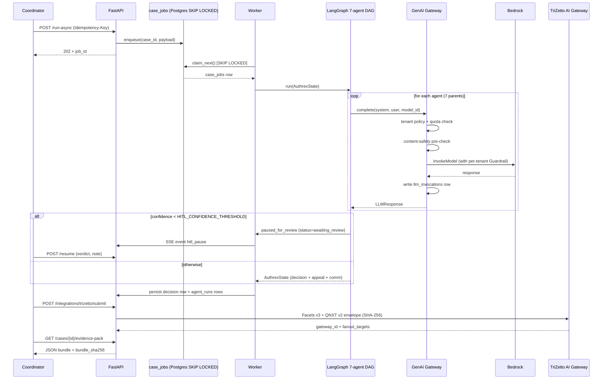
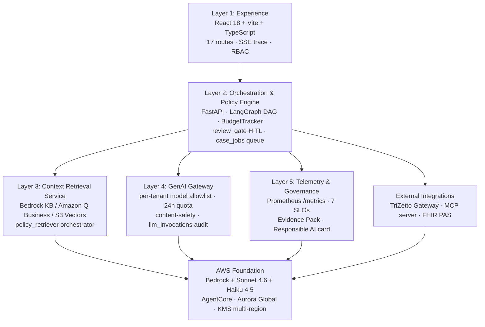
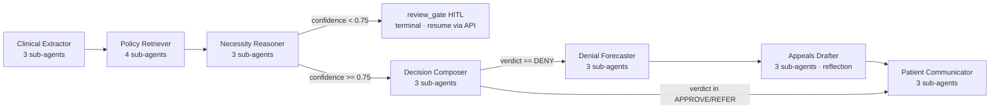

# Authrex — Architecture Diagrams

ASCII for grep-ability + Mermaid for visual rendering. Both are derived from the canonical 5-layer model in [`ops/architecture/TARGET_ARCHITECTURE.md`](../ops/architecture/TARGET_ARCHITECTURE.md).

---

## ASCII — 5-layer overview

```
┌──────────────────────────────────────────────────────────────────────────┐
│                         1.  EXPERIENCE LAYER                             │
│                                                                          │
│   React 18 SPA · TypeScript strict · Tailwind · SSE for live trace       │
│   17 routes incl. /dashboard /cases /roi /compliance /industrialize      │
│                    /architecture                                         │
│   Role-aware (coordinator / reviewer / admin)                            │
└─────────────────────────────────┬────────────────────────────────────────┘
                                  │  HTTPS · JWT · Idempotency-Key
                                  ▼
┌──────────────────────────────────────────────────────────────────────────┐
│                  2.  ORCHESTRATION & POLICY ENGINE                       │
│                                                                          │
│   FastAPI · LangGraph 7-agent DAG · BudgetTracker · review_gate (HITL)   │
│   case_jobs queue (Postgres SKIP LOCKED) · per-org quotas · response     │
│   cache · idempotent submits · 22 sub-agents                             │
└─────┬────────────────────┬────────────────────┬─────────────────┬───────┘
      │                    │                    │                 │
      ▼                    ▼                    ▼                 ▼
┌──────────────┐   ┌────────────────┐   ┌─────────────────┐  ┌─────────────┐
│ 3. CONTEXT   │   │ 4. GENAI       │   │ 5. TELEMETRY    │  │ External    │
│    RETRIEVAL │   │    GATEWAY     │   │    & GOVERNANCE │  │ INTEGRATIONS│
│              │   │                │   │                 │  │             │
│ Bedrock KB   │   │ LLMClient ABC  │   │ TraceSink ABC   │  │ TriZetto AI │
│ Amazon Q Biz │   │ Bedrock client │   │ Prometheus /met │  │  Gateway    │
│ S3 Vectors   │   │ Anthropic API  │   │ Postgres audit  │  │  (Facets v3 │
│ Policy corpus│   │ ModelRouter    │   │ Compliance      │  │  + QNXT v2) │
│ Citation     │   │  (Sonnet/Haiku │   │  scorecard      │  │             │
│  resolver    │   │  escalation)   │   │ Evidence Pack   │  │ MCP server  │
│ FHIR R4      │   │ Bedrock        │   │  (SHA-256       │  │  (5 tools)  │
│  validator   │   │  Guardrails    │   │  tamper-evident)│  │             │
│              │   │  per-tenant    │   │ Responsible AI  │  │ FHIR PAS    │
│              │   │ Budget+token   │   │  model card     │  │  endpoint   │
│              │   │  ceilings      │   │ SLO+error budg. │  │             │
└──────┬───────┘   └────────┬───────┘   └────────┬────────┘  └─────────────┘
       │                    │                    │
       ▼                    ▼                    ▼
┌──────────────────────────────────────────────────────────────────────────┐
│                          AWS Foundation                                  │
│                                                                          │
│  Bedrock (Claude Sonnet 4.6 + Haiku 4.5) · Bedrock Knowledge Base ·      │
│  Bedrock Guardrails · AgentCore Runtime · Amazon Q Business · RDS Aurora │
│  Global · S3 + KMS multi-region · ALB + WAF · IAM Identity Center · X-Ray│
│  + CloudWatch · SNS → PagerDuty · IRSA · NetworkPolicy (VPC-only egress) │
└──────────────────────────────────────────────────────────────────────────┘
```

---

## ASCII — agentic workflow shape

```
USER GOAL    → AGENT NETWORK              → ACTIONS              → OUTCOME
"Decide PA   → 7 parents + 22 sub-agents  → 5 typed actions      → APPROVE/DENY/REFER
 for         →   under GenAI Gateway      → A1 persist_decision  → time-to-decision 52s
 trastuzumab →   under BudgetTracker      → A2 route_to_review   → cost $0.25
 on patient  →   under review_gate (HITL) → A3 submit_to_TriZetto→ Evidence Pack +
 X under     →                            → A4 draft_appeal      →  bundle SHA-256
 Aetna"      →                            → A5 notify_patient    → CMS-0057-F audit-ready
```

---

## Mermaid — request lifecycle



---

## Mermaid — 5-layer block diagram



---

## Mermaid — agent DAG topology



---

## Mermaid — Cognizant alignment

```mermaid
flowchart LR
    subgraph Cognizant 2026 strategy
        VG[AI Velocity Gap<br/>Ravi Kumar Dec 2025]
        AG[AI Adaptation Gap]
        VEC[Three Vector Strategy<br/>V1 augmented · V2 agentic · V3 digital labor]
        FOUNDRY[Cognizant Agent Foundry<br/>Discover · Design · Build · Scale]
        NEURO[Cognizant Neuro AI<br/>Multi-Agent Orchestration]
        TRIZETTO[TriZetto AI Gateway<br/>Aug 6 2025 · MCP-native]
        ANT[Cognizant–Anthropic<br/>Nov 4 2025 · 350K employees on Claude]
    end

    AUTHREX[Authrex] --> VG
    AUTHREX --> AG
    AUTHREX -. V2 + V3 .-> VEC
    AUTHREX -. Build/Scale .-> FOUNDRY
    AUTHREX -. AAOSA HOCON .-> NEURO
    AUTHREX -. specialty bundle .-> TRIZETTO
    AUTHREX -. Sonnet 4.6 + MCP + Agent SDK .-> ANT
```

---

## Where these diagrams live in the demo

- **Slide 4** (Technical Design and architecture) of [`AUTHREX_MVP_DECK.pptx`](../ops/demo/AUTHREX_MVP_DECK.pptx) — embed the 5-layer ASCII as a pre-formatted text block
- **`/architecture` page** in the running app — same data live-introspected
- **README.md** — the same 5-layer ASCII at the top
